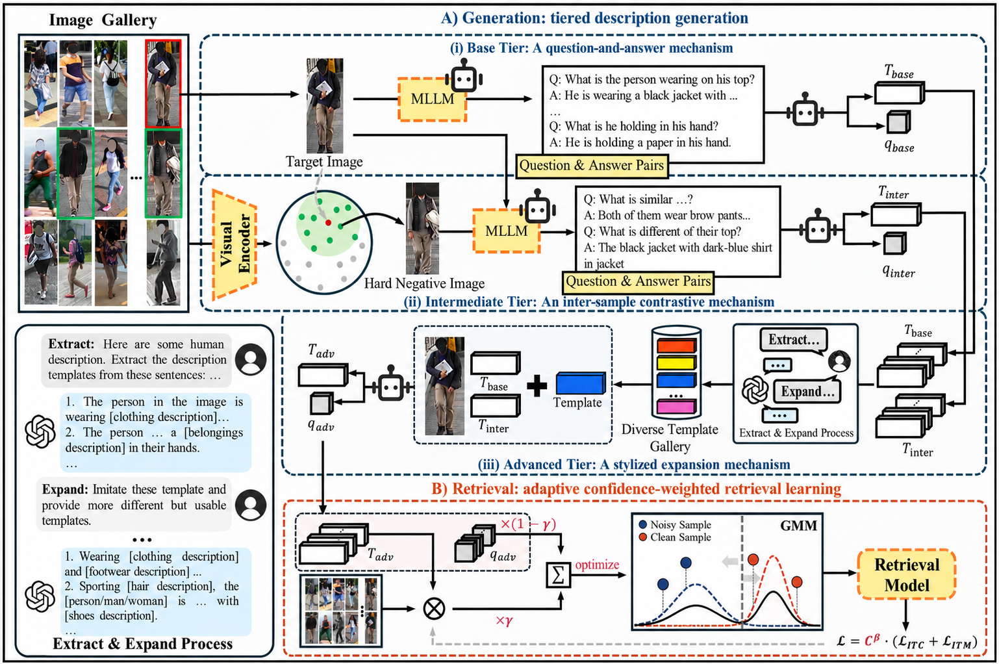

# GTR+: Generative Retrieval for Unsupervised Text-Based Person Search

<p align="center">
  <a href="https://ieeexplore.ieee.org/abstract/document/11619579/"><strong>Paper</strong></a> ·
  <a href="https://github.com/Flame-Chasers/GTR"><strong>Code</strong></a> ·
  <a href="https://drive.google.com/drive/folders/1tfJwTlLawZDEcxAhrCubpkjzApRQIdvH?usp=drive_link"><strong>LargeFine-Person</strong></a>
</p>

This repository contains the official PyTorch implementation of **Generative Retrieval for Unsupervised Text-Based Person Search**, published in **IEEE Transactions on Pattern Analysis and Machine Intelligence (TPAMI), 2026** [[Paper](https://ieeexplore.ieee.org/abstract/document/11619579/)].

**GTR+** is a generation-then-retrieval framework for unsupervised text-based person search (TBPS). It removes the need for expensive human-annotated descriptions by generating diverse pseudo descriptions and learning robust image-text retrieval models from noisy pseudo supervision.

## Highlights

GTR+ combines three key components:

- **Three-tier description generation** for producing fine-grained and stylistically diverse pseudo texts.
- **Adaptive confidence-weighted retrieval learning** for reducing the impact of noisy pseudo supervision.
- **LargeFine-Person**, a large-scale dataset for unsupervised TBPS pre-training.

<p align="center">
  
</p>


## Updates

- **[2026]** Paper published in IEEE TPAMI.
- **[2026-03-20]** Initial release of code.
- ...

## Setup

Our experiments are mainly conducted on NVIDIA L40 GPUs. The code should also run on other GPUs with sufficient memory.

We recommend using Python 3.10:

```bash
git clone https://github.com/Flame-Chasers/GTR.git
cd GTR

conda create -n gtrplus -y python=3.10
conda activate gtrplus
pip install -r requirements.txt
```


## Dataset Preparation

Download the [**CUHK-PEDES**](https://github.com/ShuangLI59/Person-Search-with-Natural-Language-Description) dataset, [**ICFG-PEDES**](https://github.com/zifyloo/SSAN) dataset and [**RSTPReid**](https://github.com/NjtechCVLab/RSTPReid-Dataset) dataset.

```
dataset_root/
├── CUHK-PEDES/
│   ├── imgs/
│   │   ├── cam_a/
│   │   ├── cam_b/
│   │   └── ...
│   └── reid_raw.json
├── ICFG-PEDES/
│   ├── imgs/
│   │   ├── test/
│   │   └── train/
│   └── ICFG_PEDES.json
├── RSTPReid/
│   ├── imgs/
│   └── data_captions.json
└── LargeFine-Person/
    ├── imgs/
    ├── LargeFine_Person_qa.json
    ├── LargeFine_Person_com.json
    └── LargeFine_Person_sty.json
```


### LargeFine-Person Dataset

Download our pre-training dataset  [**LargeFine-Person**](https://drive.google.com/drive/folders/1tfJwTlLawZDEcxAhrCubpkjzApRQIdvH?usp=drive_link)


## Configuration

Before training or evaluation, edit [`configs/blip_gmm.yaml`](configs/blip_gmm.yaml) and set the paths for your environment. In particular, check the following fields:

```yaml
val_file: '/path/to/val_file.json'
test_file: '/path/to/test_file.json'
train_file: ['/path/to/train_file.json']
image_root: '/path/to/dataset/images'
checkpoint: '/path/to/checkpoint.pth'
```

- `train_file`, `val_file`, and `test_file` specify the annotation files.
- `image_root` specifies the image directory.
- `checkpoint` specifies the initialization or trained checkpoint to load.

Other training hyperparameters, including batch size, learning rate, image size, and the confidence-weighting option, are also defined in the YAML configuration file.


## Training and Evaluation

### 1. Configure paths

Edit [`configs/blip_gmm.yaml`](configs/blip_gmm.yaml):

```yaml
val_file: '/path/to/val_file.json'
test_file: '/path/to/test_file.json'
train_file: ['/path/to/train_file.json']

image_root: '/path/to/dataset/images'
checkpoint: '/path/to/checkpoint.pth'
```

Other hyperparameters, including batch size, learning rate, image size, and confidence weighting, are defined in the same configuration file.

### 2. Train

```bash
bash shell/train.sh
```

### 3. Evaluate

```bash
bash shell/eval.sh
```

Before running the scripts, update `OUTPUT_DIR`, `CUDA_VISIBLE_DEVICES`, and `--nproc_per_node` as needed. The current example uses one process for training and four processes for evaluation.

## Main Results

### Unsupervised TBPS Results ([BLIP](https://github.com/salesforce/BLIP) as Baseline)

**CUHK-PEDES**

| Method                                                       |                  Baseline                  | Fine-tuning |    R@1    | R@5       | R@10      | mAP       |                          Checkpoint                          |
| ------------------------------------------------------------ | :----------------------------------------: | :---------: | :-------: | --------- | --------- | --------- | :----------------------------------------------------------: |
| [GTR](https://arxiv.org/abs/2305.12964)                      | [BLIP](https://github.com/salesforce/BLIP) |             |   47.53   | 68.23     | 75.91     | 42.91     |                              /                               |
| [GAAP](https://www.ijcai.org/proceedings/2024/116)           | [BLIP](https://github.com/salesforce/BLIP) |             |   47.64   | 67.79     | 76.08     | 41.28     |                              /                               |
| [MUMA](https://ojs.aaai.org/index.php/AAAI/article/view/32543 ) | [BLIP](https://github.com/salesforce/BLIP) |             |   59.52   | 77.79     | 84.65     | 52.75     |                              /                               |
| **GTR+**                                                     | [BLIP](https://github.com/salesforce/BLIP) |             | **61.35** | **79.35** | **85.75** | **55.75** | **[Download](https://drive.google.com/file/d/1ZuFGroJ-Iqx30i73LeOSI_B-8Jcc5qcn/view?usp=drive_link)** |
| **GTR+ (Pre-trained)**                                       | [BLIP](https://github.com/salesforce/BLIP) |      ✗      | **62.65** | **78.80** | **84.76** | **55.27** | **[Download](https://drive.google.com/file/d/1ZDo7KgSwVDjFNTVuyWqfMZ3awPuYUqhg/view?usp=drive_link)** |
| **GTR+ (Pre-trained)**                                       | [BLIP](https://github.com/salesforce/BLIP) |      ✓      | **64.65** | **80.72** | **86.78** | **58.67** | **[Download](https://drive.google.com/file/d/1oHhPkk52BCljjVhLzHti-HwDin3HYGtk/view?usp=drive_link)** |

**ICFG-PEDES**

| Method                                                       |                  Baseline                  | Fine-tuning |    R@1    | R@5       | R@10      | mAP       |                          Checkpoint                          |
| ------------------------------------------------------------ | :----------------------------------------: | :---------: | :-------: | --------- | --------- | --------- | :----------------------------------------------------------: |
| [GTR](https://arxiv.org/abs/2305.12964)                      | [BLIP](https://github.com/salesforce/BLIP) |             |   28.25   | 45.21     | 53.51     | 13.82     |                              /                               |
| [GAAP](https://www.ijcai.org/proceedings/2024/116)           | [BLIP](https://github.com/salesforce/BLIP) |             |   27.12   | 44.91     | 53.56     | 11.43     |                              /                               |
| [MUMA](https://ojs.aaai.org/index.php/AAAI/article/view/32543 ) | [BLIP](https://github.com/salesforce/BLIP) |             |   38.11   | 56.01     | 63.96     | 19.02     |                              /                               |
| **GTR+**                                                     | [BLIP](https://github.com/salesforce/BLIP) |             | **47.81** | **64.97** | **71.94** | **28.75** | **[Download](https://drive.google.com/file/d/1LPTIfh6FbrFh_sBhoLiaDD5Q0UvtTZnG/view?usp=drive_link)** |
| **GTR+ (Pre-trained)**                                       | [BLIP](https://github.com/salesforce/BLIP) |      ✗      | **47.53** | **64.32** | **71.39** | **25.38** | **[Download](https://drive.google.com/file/d/1R91hfkyvWuYPtuUv8nta5SEvRDTRdtVB/view?usp=drive_link)** |
| **GTR+ (Pre-trained)**                                       | [BLIP](https://github.com/salesforce/BLIP) |      ✓      | **52.78** | **67.94** | **73.91** | **33.99** | **[Download](https://drive.google.com/file/d/1nYTpZgZFw8AVQbYYd9_k3hgoixb1T5_q/view?usp=drive_link)** |

**RSTPReid**

|                            Method                            |                  Baseline                  | Fine-tuning |       R@1 |       R@5 |      R@10 | mAP       |                          Checkpoint                          |
| :----------------------------------------------------------: | :----------------------------------------: | :---------: | --------: | --------: | --------: | --------- | :----------------------------------------------------------: |
|           [GTR](https://arxiv.org/abs/2305.12964)            | [BLIP](https://github.com/salesforce/BLIP) |             |     45.60 |     70.35 |     79.95 | 33.30     |                              /                               |
|      [GAAP](https://www.ijcai.org/proceedings/2024/116)      | [BLIP](https://github.com/salesforce/BLIP) |             |     44.45 |     65.15 |     75.30 | 31.21     |                              /                               |
| [MUMA](https://ojs.aaai.org/index.php/AAAI/article/view/32543 ) | [BLIP](https://github.com/salesforce/BLIP) |             |     54.35 |     76.05 |     83.65 | 40.50     |                              /                               |
|                           **GTR+**                           | [BLIP](https://github.com/salesforce/BLIP) |             | **54.75** | **75.15** | **83.50** | **43.79** | **[Download](https://drive.google.com/file/d/1Dz_9rLgGPeCP4yLYH-7fFF2dYiBX3Z-W/view?usp=drive_link)** |
|                    **GTR+ (Pre-trained)**                    | [BLIP](https://github.com/salesforce/BLIP) |      ✗      | **52.00** | **74.05** | **82.35** | **38.72** | **[Download](https://drive.google.com/file/d/11A8LlAsA_2kFJK5bcJS5HnF8BrDVpXr8/view?usp=drive_link)**                     |
|                    **GTR+ (Pre-trained)**                    | [BLIP](https://github.com/salesforce/BLIP) |      ✓      | **55.70** | **76.55** | **84.25** | **43.86** | **[Download](https://drive.google.com/file/d/1R5Y9P5-KJJtr393q6kGcQIU5EIo6ZXmi/view?usp=drive_link)** |


### Supervised TBPS Results ([IRRA](https://github.com/anosorae/IRRA/tree/main) as Baseline)

**CUHK-PEDES**

| Method   |                      Baseline                      | Fine-tuning | R@1   | R@5   | R@10  | mAP   |                          Checkpoint                          |
| -------- | :------------------------------------------------: | :---------: | ----- | ----- | ----- | ----- | :----------------------------------------------------------: |
| **GTR+** | [IRRA](https://github.com/anosorae/IRRA/tree/main) |             | 59.44 | 78.54 | 85.22 | 54.11 | **[Download](https://drive.google.com/file/d/1hbLyoTAeA8HvA5zPM51_dNgQKAUOq5pc/view?usp=drive_link)** |
| **GTR+** | [IRRA](https://github.com/anosorae/IRRA/tree/main) |      ✓      | 77.13 | 90.82 | 94.49 | 68.37 | **[Download](https://drive.google.com/file/d/1xss3Wu2NVYm0vP9WmMzREIHSDWaLAVxL/view?usp=drive_link)** |

**ICFG-PEDES**

| Method   |                      Baseline                      | Fine-tuning | R@1   | R@5   | R@10  | mAP   |                          Checkpoint                          |
| -------- | :------------------------------------------------: | :---------: | ----- | ----- | ----- | ----- | :----------------------------------------------------------: |
| **GTR+** | [IRRA](https://github.com/anosorae/IRRA/tree/main) |             | 43.77 | 60.77 | 68.05 | 22.30 | **[Download](https://drive.google.com/file/d/1jvL9Q7hjn0W_0JrFPqvnHVdYImUphOMh/view?usp=drive_link)** |
| **GTR+** | [IRRA](https://github.com/anosorae/IRRA/tree/main) |      ✓      | 67.80 | 82.81 | 87.66 | 41.00 | **[Download](https://drive.google.com/file/d/1E9s7-Gd-d8Krgo_1WmCapYSml_nwandd/view?usp=drive_link)** |

**RSTPReid**

| Method   |                      Baseline                      | Fine-tuning | R@1   | R@5   | R@10  | mAP   |                          Checkpoint                          |
| -------- | :------------------------------------------------: | :---------: | ----- | ----- | ----- | ----- | :----------------------------------------------------------: |
| **GTR+** | [IRRA](https://github.com/anosorae/IRRA/tree/main) |             | 50.45 | 73.45 | 82.35 | 37.68 | **[Download](https://drive.google.com/file/d/1WJhGlMqsJEDqN0UyVX5AxtRaZjev_V2_/view?usp=drive_link)** |
| **GTR+** | [IRRA](https://github.com/anosorae/IRRA/tree/main) |      ✓      | 69.05 | 86.90 | 92.25 | 54.19 | **[Download](https://drive.google.com/file/d/1sZ7670RJMjOx-Xs7l3UHZGsVEzhA4EHW/view?usp=drive_link)** |


## More Examples

More qualitative examples of generated descriptions and retrieval results are shown below.


## Citation

If you find this code useful for your research, please cite our paper.

```bibtex
@ARTICLE{11619579,
  author={Ye, Mang and Ji, Yucheng and Bai, Yang and Cao, Min and Chai, Siyuan and Du, Bo and Zhang, Min},
  journal={IEEE Transactions on Pattern Analysis and Machine Intelligence}, 
  title={Generative Retrieval for Unsupervised Text-Based Person Search}, 
  year={2026},
  volume={},
  number={},
  pages={1-17},
  keywords={Modeling;Training;Conferences;Learning (artificial intelligence);Machining;Computers;Machine intelligence;Noise measurement;Pattern analysis;Text to image;Image captioning;person re-identification;text-based person search;unsupervised learning},
  doi={10.1109/TPAMI.2026.3713379}}
```

